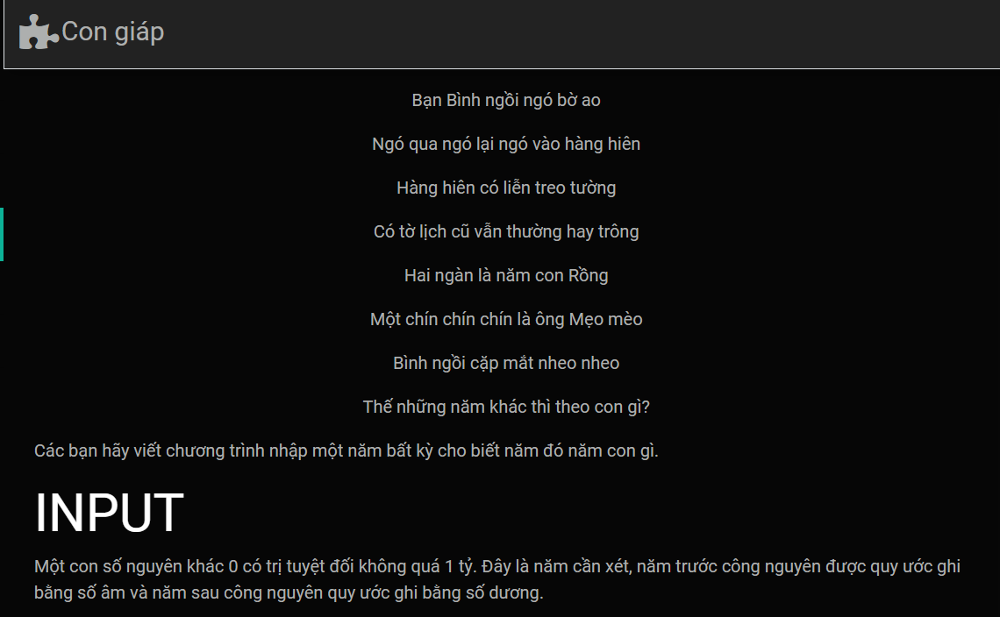
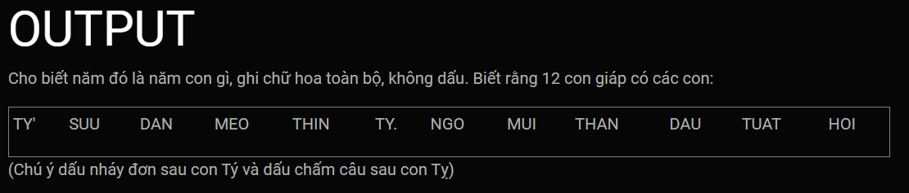
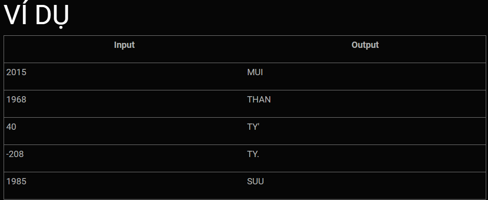

Chuẩn bị mảng string chứa tên các con con giáp, lấy mốc năm 2000 - năm Thìn làm mốc<br>
Ta thấy các con giáp theo chu kì 12 năm lặp lại một lần nên ta sẽ lấy ```k = (n - 2000) % 12```, với k chính là thứ tự con giáp trong mảng đã chuẩn bị.