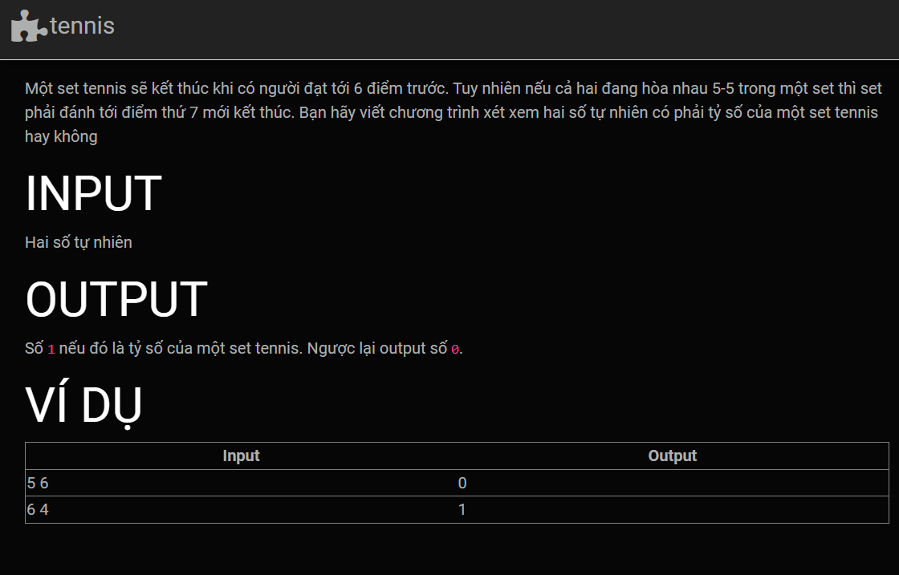

Ở đây ta thấy có 3 trường hợp để 1 set tennis được coi là hợp lệ : 

- Một bên 6 điểm và bên còn lại ít hơn 5 điểm
- Một bên 7 điểm và bên còn lại 5 điểm
- Một bên 7 điểm và bên còn lại 6 điểm

Các trường hợp còn lại là không hợp lệ.