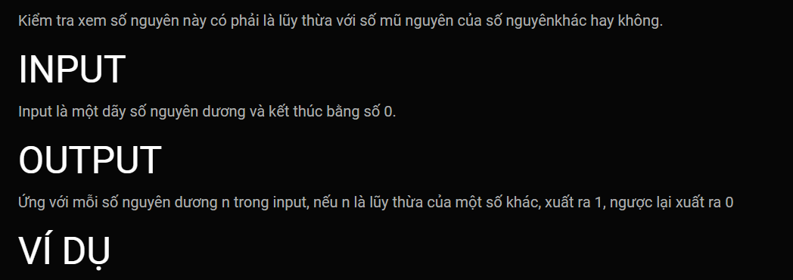

***Là lũy thừa***
===

**INPUT:**
335  
611  
775  
756  
804  
457  
834  
363  
316  
258  
1000  
350  
285  
65  
673  
177  
976  
896  
625  
18  
104  
588  
925  
289  
609  
658  
0  

**OUTPUT:**
0  
0  
0  
0  
0  
0  
0  
0  
0  
0  
1  
0  
0  
0  
0  
0  
0  
0  
1  
0  
0  
0  
0  
1  
0  
0  