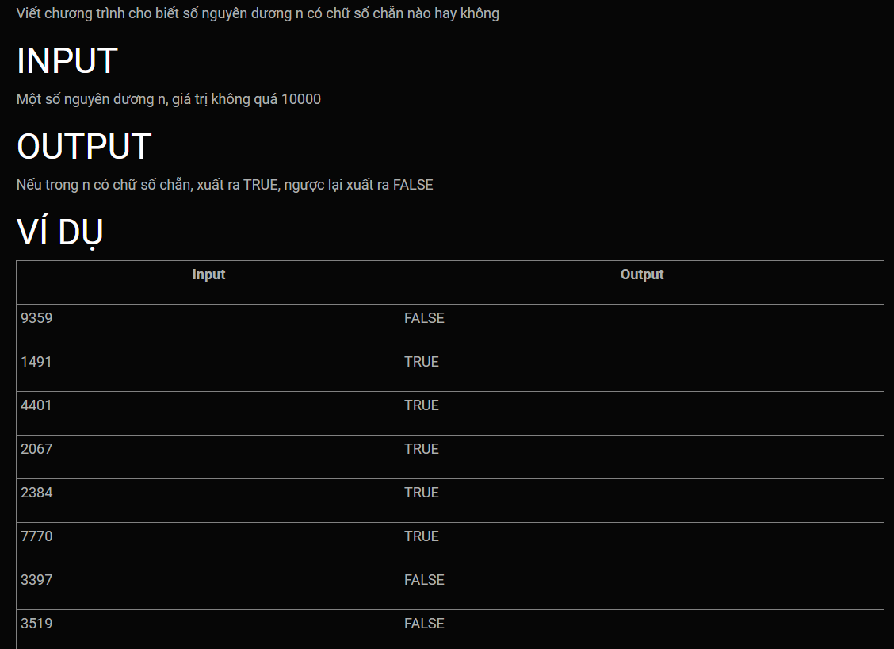
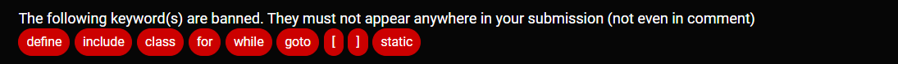

***Chữ số chẵn***
===




Template's header, these lines will goes before your code:<br>
```c++
#include <iostream>
using namespace std;

bool contain_even_digit(int n){

```

Template's footer, These lines will goes after your code:<br>
```c++

}

int main (){
    int n; cin >> n;
    if (contain_even_digit(n)) cout << "TRUE";
    else cout << "FALSE";
}
```