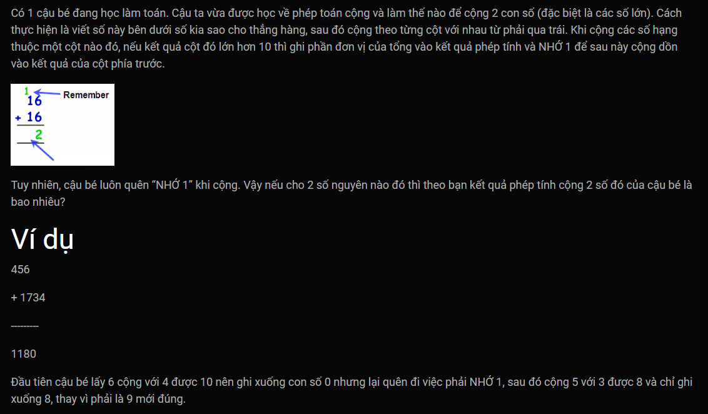
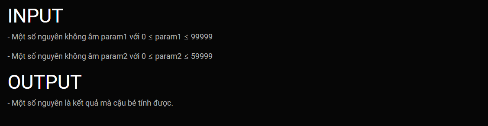
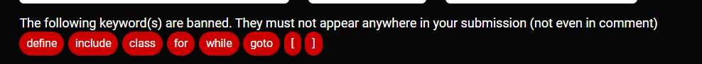

***Cộng không có nhớ***
===




Template's header, these lines will goes before your code:<br>
```c++
#include <iostream>
using namespace std;

```

<br>

Template's footer, These lines will goes after your code:<br>
```c++

int main (){
    int param1, param2;
    cin >> param1 >> param2;
	cout << sum_without_remember(param1, param2);
}
```