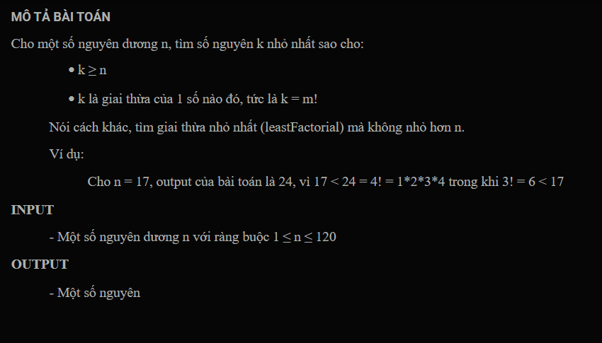
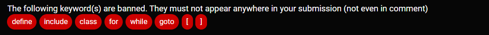

***Giai thừa nhỏ nhất***
===



Template's header, these lines will goes before your code:<br>
```c++
#include <iostream>
using namespace std;

```

<br>

Template's footer, These lines will goes after your code:<br>
```c++

int main(){
	int n;
	cin >> n;
	cout << smallest_factorial_notless_than(n);
}
```