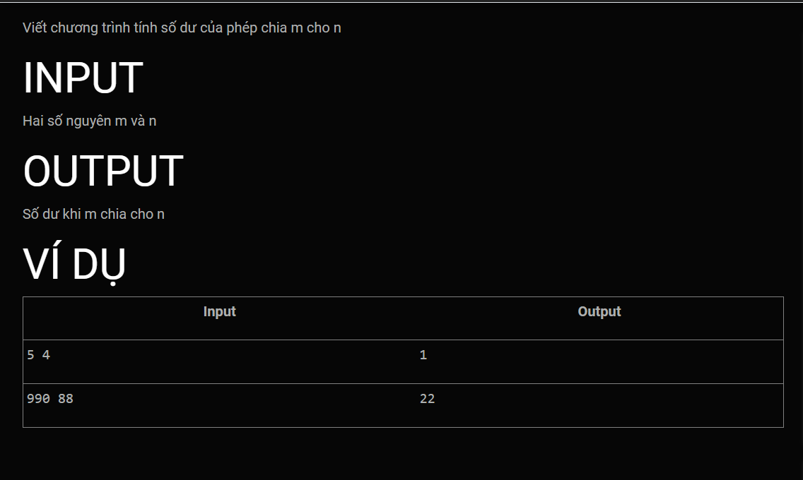
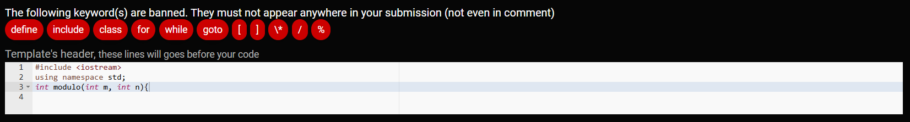

Template's header, these lines will goes before your code:<br>
```c++
#include <iostream>
using namespace std;
int modulo(int m, int n){
```

Template's footer, These lines will goes after your code:
```c++

}


int main (){
    int m, n; cin >> m >> n;
	cout << modulo(m, n);
}
```