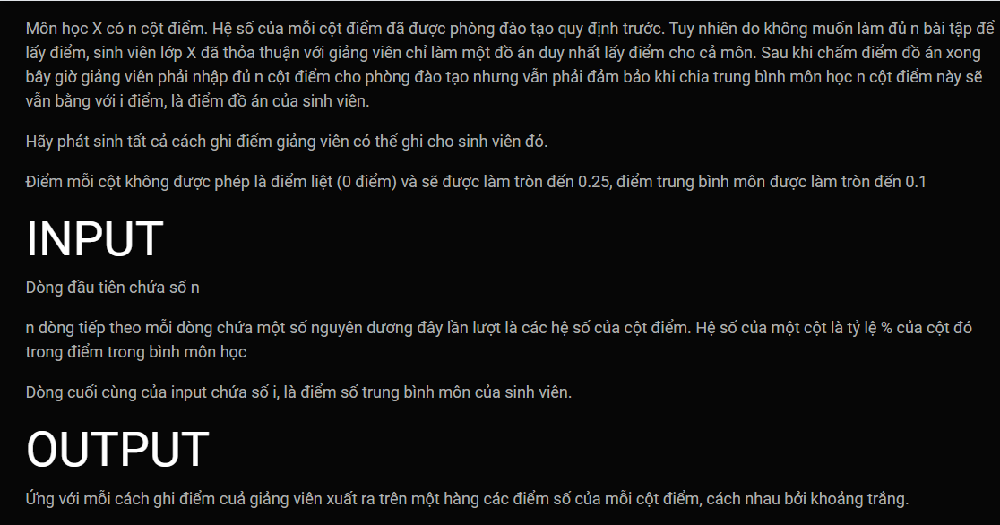

***nhập điểm***
===


**VÍ DỤ**<br>
Input:<br>
```
3
20
30
50
9.5
```

Output:<br>
```
7.25 10 10
7.5 10 10
7.75 9.75 10
8 9.5 10
8 9.75 10
8 10 9.75
8.25 9.5 10
8.25 9.75 9.75
8.25 10 9.75
8.5 9.25 10
8.5 9.75 9.75
8.5 10 9.5
8.75 9 10
8.75 9.25 10
8.75 9.5 9.75
8.75 10 9.5
9 9 10
9 9.25 9.75
9 9.5 9.75
9 9.75 9.5
9.25 8.75 10
9.25 9.25 9.75
9.25 9.5 9.5
9.25 9.75 9.5
9.25 10 9.25
9.5 8.5 10
9.5 8.75 10
9.5 9 9.75
9.5 9.5 9.5
9.5 9.75 9.25
9.5 10 9.25
9.75 8.5 10
9.75 8.75 9.75
9.75 9 9.75
9.75 9.25 9.5
9.75 9.75 9.25
9.75 10 9
10 8.25 10
10 8.75 9.75
10 9 9.5
10 9.25 9.5
10 9.5 9.25
10 10 9
```

Lưu ý nhỏ khi làm bài này:
---
Khi tính toán tổng (hoặc hiệu) phân số với kiểu dữ liệu **double** ta nên tính tổng các tử trước rồi mới đem chia cho mẫu. Tính như vậy sẽ trảnh bị sai số khi tính toán với **double**.<br>
Ví dụ: Thay vì tính 20/100 + 30/100 + 50/100, ta nên tính **(20 + 30 + 50) / 100**.