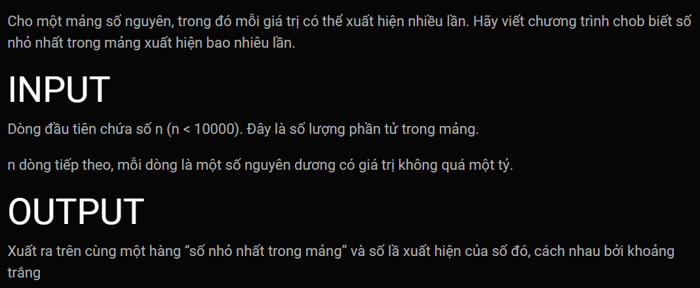
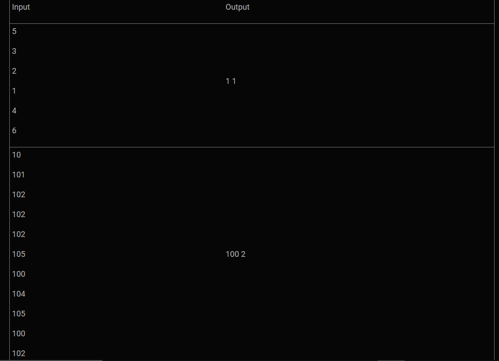
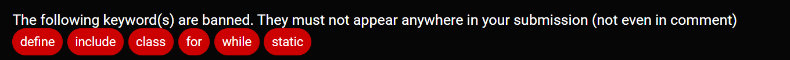

***Đếm min***
===



---
Template's header, these lines will goes before your code:<br>
```c++
#include <iostream>
#include <string>
#include <utility>
using namespace std;

pair<int, int> count_min(int a[], int n){

```
<br>

Template's footer, These lines will goes after your code:<br>

```c++
}
int main()
{
    int n;
    cin >> n;
    int a[10000];

    for (int i = 0; i < n; i++){
        cin >> a[i];
    }

    auto b = count_min(a, n);
    cout << to_string(b.first) + " " + to_string(b.second);
    return 0;
}
```