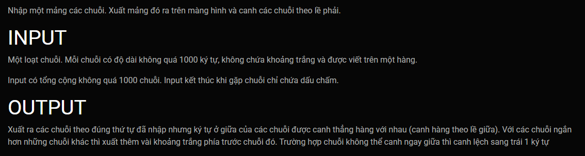

***Chuỗi canh giữa***
===

Input:<br>
```
czgz
eqcubn
ihd
cpl
vvvoc
hmoxauqin
rsfeavf
yoaag
g
hbq
txfrecusr
kv
naulnavj
eytc
q
dw
sigmvlc
o
lcwf
v
v
nujthxhhnn
vx
av
glgr
gxjzowdnd
ekjqhzy
vwa
pamgrftcl
k
geicvfs
zcenmsufl
us
aajzjs
teymds
cfqutaj
szymuprdgp
rhp
oqop
azirgoezlm
nzyfqrw
ujd
aneriis
bynqpwfve
rqzme
widpqixvpv
.
```

Output:<br>
```
   czgz
  eqcubn
   ihd
   cpl
  vvvoc
hmoxauqin
 rsfeavf
  yoaag
    g
   hbq
txfrecusr
    kv
 naulnavj
   eytc
    q
    dw
 sigmvlc
    o
   lcwf
    v
    v
nujthxhhnn
    vx
    av
   glgr
gxjzowdnd
 ekjqhzy
   vwa
pamgrftcl
    k
 geicvfs
zcenmsufl
    us
  aajzjs
  teymds
 cfqutaj
szymuprdgp
   rhp
   oqop
azirgoezlm
 nzyfqrw
   ujd
 aneriis
bynqpwfve
  rqzme
widpqixvpv
```

<br>

---
Template's header, these lines will goes before your code:<br>
```c++
#include <iostream>
#include <cstring>
using namespace std;
```
Template's footer, These lines will goes after your code:<br>
```c++


int main()
{
    char A[1000][1000];
    int n;
    input(A, n);
    output(A, n);
}
```