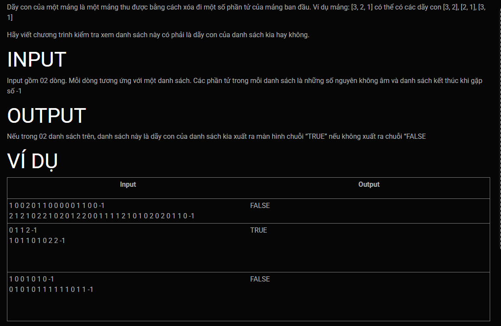

***Là dãy con***
===

---
<br>

Input:
```
1 0 0 2 0 1 1 0 0 0 0 0 1 1 0 0 -1
2 1 2 1 0 2 2 1 0 2 0 1 2 2 0 0 1 1 1 1 2 1 0 1 0 2 0 2 0 1 1 0 -1
```
Output:
```
FALSE
```
---
<br>

Input:
```
0 1 1 2 -1
1 0 1 1 0 1 0 2 2 -1
```
Output:
```
TRUE
```
---
<br>

Input:
```
1 0 0 1 0 1 0 -1
0 1 0 1 0 1 1 1 1 1 1 0 1 1 -1
```
Output:
```
FALSE
```
---
<br>

Template's header, these lines will goes before your code:<br>
```c++
#include <iostream>

using std::cin;
using std::cout;
using std::endl;

struct Node{
    int val;
    Node* next;
};

struct List{
    Node *head, *tail;
    int x;
};

void list_initializing(List &l){
    l.head = l.tail = NULL;
}
void add_tail(List &l, int x){
    Node*p = new Node;
    p->val = x;
    p->next = NULL;

    if (l.head == NULL){
        l.head = l.tail = p;
    } else {
        l.tail->next = p;   
        l.tail = p;
    }
}

void xuat(List &l){
    for(Node *p = l.head; p != NULL; p = p->next){
        cout << p->val << " ";
    }
    cout << endl;
}
```
Template's footer, These lines will goes after your code:<br>
```c++
int main()
{
    cin.tie(NULL);
    std::ios_base::sync_with_stdio(false);
    List lists[2];

    for(int i = 0; i < 2; i++){
        list_initializing(lists[i]);
        int x;
        do{
            cin >> x;
            if (x != -1) add_tail(lists[i], x);
            else break;
        } while(true);
    }

    if ( is_subsequence(lists[0], lists[1])) cout << "TRUE";
    else cout << "FALSE";


    return 0;
}
```