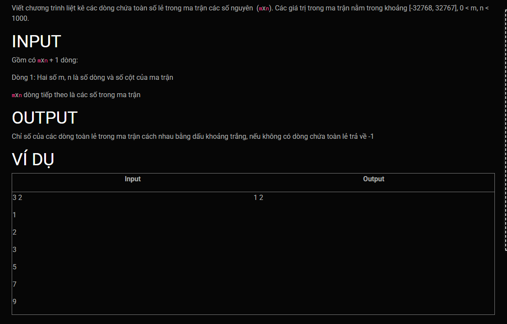

***dòng chứa toàn số lẻ***
===


---
<br>

Template's header, these lines will goes before your code:<br>
```c++

#include <iostream>
using namespace std;
#define MAX 1000

void input(int arr[][MAX], unsigned int &m, unsigned int &n);
void output(int arr[][MAX], unsigned int m, unsigned int n);
void findOddRows(int arr[][MAX], unsigned int m, unsigned int n);
```
Template's footer, These lines will goes after your code:<br>
```c++

int main()
{
    int arr[MAX][MAX];
    unsigned int m;
    unsigned int n;


    input(arr, m, n);
    findOddRows(arr, m, n);

    return 0;
}
```