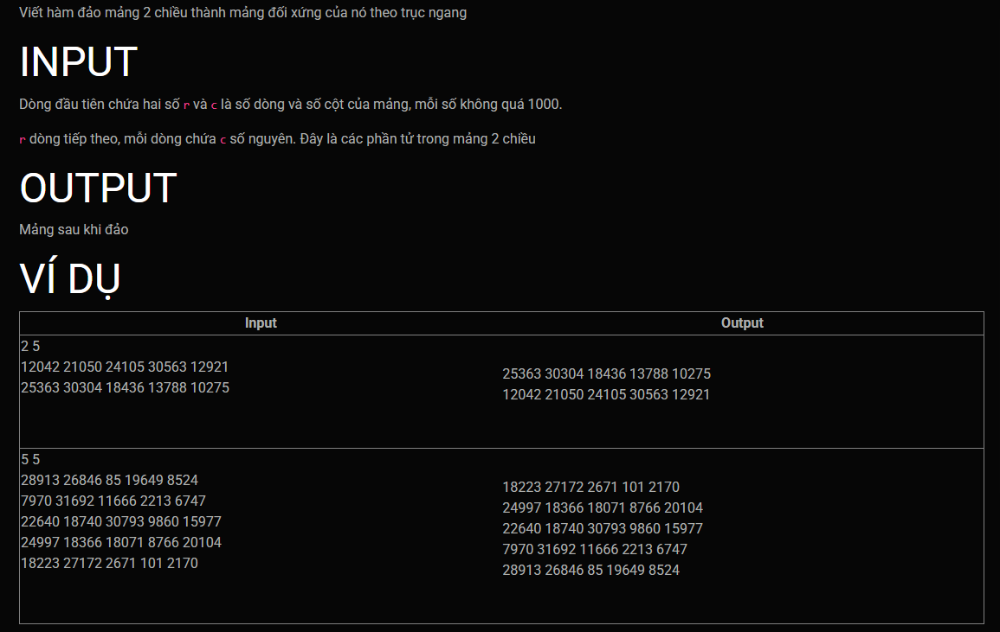

***Đối xứng dọc***
===


---
Input:<br>
```
2 5
12042 21050 24105 30563 12921
25363 30304 18436 13788 10275
```
Output:<br>
```
25363 30304 18436 13788 10275
12042 21050 24105 30563 12921
```

---

Input:<br>
```
5 5
28913 26846 85 19649 8524
7970 31692 11666 2213 6747
22640 18740 30793 9860 15977
24997 18366 18071 8766 20104
18223 27172 2671 101 2170
```
Output:<br>
```
18223 27172 2671 101 2170
24997 18366 18071 8766 20104
22640 18740 30793 9860 15977
7970 31692 11666 2213 6747
28913 26846 85 19649 8524
```

Template's header, these lines will goes before your code:<br>
```c++
#include <iostream>

using namespace std;


void horizontal_invert(
```

Template's footer, These lines will goes after your code:<br>
```c++

}

int main()
{
    int n, m;
    cin >> n >> m;

    
    int a[1000][1000];
    
    input(a, n, m); //Hàm này đã được code chuẩn không thể chỉnh, sinh viên không cần quan tâm
    
    horizontal_invert(a, n, m);

    output(a, n, m);//Hàm này đã được code chuẩn không cần chỉnh, sinh viên không cần quan tâm
    
    return 0;
}
```